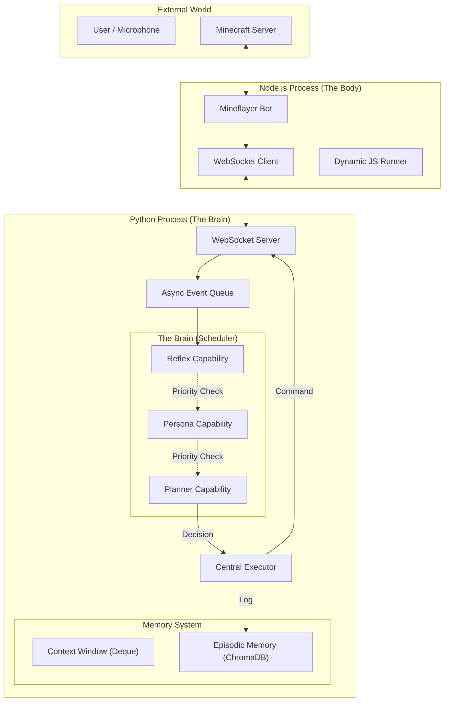

# Minecraft Agent (MVP) 架构设计文档

Generated by Gemini.

## 1. 项目愿景 (Vision)

我们要构建一个具备**长期记忆**、能够**自然协作**、并具备**自我进化潜力**的 Minecraft 智能体。
与传统的“刷题机”（如 Voyager）不同，本项目侧重于：
1.  **Human-in-the-loop**: 实时响应人类指令与闲聊。
2.  **System 1 & 2**: 融合快速反应（反射）与慢速思考（规划）。
3.  **Safety**: 代码生成的安全性与系统鲁棒性。

---

## 2. 核心设计原则 (Design Principles)

1.  **身心分离 (Decoupled Body & Mind)**:
    *   **大脑 (Python)**: 负责记忆、决策、推理。运行在独立的进程。
    *   **身体 (Node.js)**: 负责感知环境、执行动作。运行在独立的进程。
    *   两者通过 **WebSocket** 进行全双工通信。

2.  **分层控制架构 (Hierarchical Control)**:
    *   采用 **System 1 (直觉)** 和 **System 2 (逻辑)** 分离的设计。
    *   高优先级的反射模块（如生存）可以“短路”低优先级的规划模块。

3.  **意图与执行分离 (Intent vs. Execution)**:
    *   决策模块只产生“意图数据”（Decision Data）。
    *   由统一的执行器（Executor）负责记录日志、发送指令。确保行为的可追溯性。

4.  **沙盒化进化 (Sandboxed Evolution)**:
    *   LLM 不允许修改 Python 核心代码。
    *   自我进化通过修改 **JS 脚本 / JSON 配置** 并在 Node.js 端热重载来实现。

---

## 3. 系统架构图 (System Context)



---

## 4. 模块详细设计 (Component Design)

### 4.1 接口层 (Interfaces)
采用 **星形拓扑 (Star Topology)**。Python 作为 Hub，所有外部输入皆为 Client。

*   **技术栈**: FastAPI + WebSockets
*   **协议**: JSON
    *   **Input**: `{ "source": "mc|mic", "type": "chat|event", "content": ... }`
    *   **Output**: `{ "target": "mc|live2d", "action": "run_script|say", "payload": ... }`
*   **扩展性**: 未来接入 VAD 或 Live2D 时，只需新增一种 WebSocket Client 类型，无需修改核心逻辑。

### 4.2 大脑中枢 (The Brain)
大脑是一个**基于优先级的责任链调度器**。

*   **职责**:
    1.  从事件队列提取事件。
    2.  按优先级 (`Priority`) 轮询所有注册的 `Capability`。
    3.  询问 `Capability.can_handle(context)`。
    4.  若激活，获取其 `Decision` 并终止轮询（除非是非阻塞行为）。
*   **Capabilities 示例**:
    *   `SurvivalReflex` (P100): 检测 `health < 5` 或 `in_water`，直接返回逃跑脚本。
    *   `ChatInterface` (P50): 检测用户对话，调用 LLM 进行角色扮演回复。
    *   `TaskSolver` (P10): 也就是 Voyager 的核心部分，负责复杂的长期任务规划。

### 4.3 记忆系统 (Memory)
*   **短期记忆 (Context)**: 使用 `collections.deque` 维护最近 N 轮对话/事件，直接注入 LLM Prompt。
*   **情景记忆 (Episodic)**: 使用 **ChromaDB** 存储 `(Embedding, Text, Timestamp)`。用于检索“上次我们做了什么”。
*   **技能库 (Skill Library)**: 存储 JS 代码片段，索引为 `Task Description`。

### 4.4 执行层 (Bridge & Body)
*   **Python 端**: `Executor` 类。
    *   收到 `Decision` 对象。
    *   将 `Decision` 写入审计日志（Action Log）。
    *   通过 WebSocket 发送给 Node.js。
*   **Node.js 端**:
    *   **Native Listener**: 监听 `chat`, `spawn`, `health` 等原生事件并转发。
    *   **Dynamic Runner**: 接收 Python 发来的 JS 代码字符串，使用 `new AsyncFunction(...)` 包装执行。

---

## 5. 数据流示例 (Data Flow)

### 场景：用户说“去挖点铁”

1.  **Input**:
    *   Mineflayer (Node) 监听到聊天。
    *   发送 WS: `{ "type": "chat", "user": "Steve", "text": "去挖点铁" }`。
2.  **Ingestion**:
    *   Python WS Server 接收，放入 `incoming_events` 队列。
    *   `ContextManager` 记录对话历史。
3.  **Reasoning**:
    *   `Brain` 轮询。
    *   `Reflex` (P100) -> 忽略。
    *   `ChatInterface` (P50) -> 发现是指令而非闲聊，忽略（或转交）。
    *   `TaskSolver` (P10) -> `can_handle` 返回 True。
    *   `TaskSolver` 调用 LLM，生成规划，检索技能，生成 JS 代码。
    *   返回 Decision: `{ "type": "run_code", "code": "bot.findBlock(iron)..." }`。
4.  **Execution**:
    *   `Executor` 记录日志：“开始挖铁任务”。
    *   通过 WS 发送代码给 Node。
5.  **Action**:
    *   Node 执行 JS，Bot 开始移动。

---

## 6. 项目目录结构 (Directory Structure)

```text
MyAgent/
├── agent/                  # Python 核心 (The Brain)
│   ├── core.py             # Main Loop, JarvisAgent 类
│   ├── brain.py            # 调度器逻辑
│   ├── executor.py         # 统一执行与日志
│   ├── memory/             # 记忆模块
│   │   ├── context.py      # 短期记忆窗口
│   │   └── episodic.py     # ChromaDB 封装
│   └── capabilities/       # 能力插件目录
│       ├── base.py         # 抽象基类
│       ├── reflexes/       # System 1 脚本
│       └── planning/       # System 2 (Voyager port)
│
├── interfaces/             # 通信接口
│   ├── server.py           # FastAPI WebSocket Server
│   └── protocol.py         # 协议定义
│
├── bridge/                 # Node.js 核心 (The Body)
│   ├── index.js            # Express/WS Client 入口
│   ├── bot_factory.js      # Mineflayer 初始化
│   └── script_runner.js    # 动态代码执行器
│
├── data/                   # 持久化数据
│   ├── memory_db/          # ChromaDB 文件
│   ├── skill_lib/          # 保存生成的 JS 技能
│   └── config/             # 配置文件 (Prompt, Keys)
│
└── docs/                   # 文档
    └── ARCHITECTURE.md     # 本文件
```

---

## 7. 安全与进化策略 (Safety & Evolution)

*   **禁止**: LLM 直接重写 `agent/` 目录下的 Python 代码。
*   **允许**:
    1.  LLM 生成新的 JS 文件存入 `data/skill_lib/`。
    2.  LLM 修改 `bridge/scripts/` 下的特定行为脚本（如战斗走位）。
    3.  Node.js 端通过 `require` 或动态加载机制读取最新脚本。
*   **Fallback**: 所有执行代码需包裹在 `try-catch` 中，一旦执行失败，Bot 应立即停止动作并向 Python 报错。

---

## 8. MVP 阶段目标 (Roadmap)

1.  **Phase 1 (Skeleton)**:
    *   跑通 Python 与 Node 的 WebSocket 通信。
    *   实现 `Hello World`：Python 发令，Bot 说话。
2.  **Phase 2 (Brain)**:
    *   实现 `Brain` 调度器和 `BaseCapability`。
    *   接入 LLM API。
    *   实现基础的 `ChatCapability` (能对话)。
3.  **Phase 3 (Hands)**:
    *   移植 Voyager 的基础动作原语。
    *   实现 `CodeExecutionCapability` (能写代码挖矿)。
4.  **Phase 4 (Memory)**:
    *   接入 ChromaDB，实现跨会话记忆。
